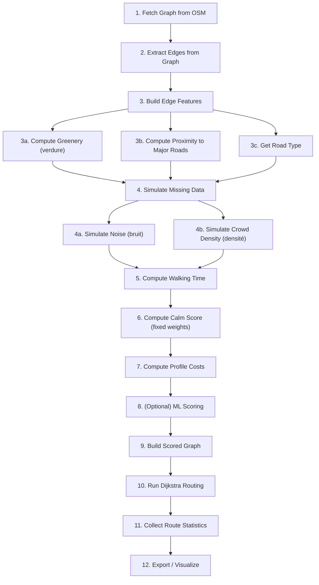

# NeuroRoute Calme — Full Pipeline Overview

> A step-by-step guide of everything that happens from **raw OpenStreetMap data** to a **routed path on the map**, written in plain English.


## Pipeline Diagram



---

## Step 1 — Fetch the Street Graph from OpenStreetMap

**What happens:** We download the full pedestrian walking network of Casablanca from OpenStreetMap using the OSMnx library. If we already downloaded it before, we load it from a local cache file instead (so it's fast).

**What we get:** A directed multigraph (NetworkX `MultiDiGraph`) where every **node** is an intersection and every **edge** is a street segment. Each node has latitude/longitude coordinates, and each edge has properties like `length` (meters) and `highway` (road type).

**Code:**
- `main.py` — `fetch_graph()` → lines 302–352
  - Configures OSMnx caching → line 304-306
  - Adds extra useful tags (sidewalk, lit, surface, etc.) → line 309-317
  - Checks for cached `.graphml` file → line 330-335
  - If not cached, calls `ox.graph_from_place()` with `network_type="walk"` → line 338
  - Saves to cache for next time → line 341-350
- Called from `main()` → `main.py` line 1058

---

## Step 2 — Extract Edges from the Graph

**What happens:** We convert the graph into a flat table (Pandas DataFrame). Each row = one street segment. We keep the edge identifiers (`u`, `v`, `key`) so we can map data back to the graph later.

**What we get:** A DataFrame with columns: `u`, `v`, `key`, `segment_id`, `longueur` (length in meters), `type_route` (road type like "residential", "footway", etc.).

**Code:**
- `main.py` — `build_edge_features()` → lines 359–397
  - `ox.graph_to_gdfs()` converts graph edges to a GeoDataFrame → line 371
  - Builds the base DataFrame with `u`, `v`, `key` → line 374-378
  - Creates `segment_id` = `"u_v_key"` → line 379-381
  - Gets `longueur` from the `length` attribute → line 382
  - Cleans up the `highway` tag using `flatten_highway()` → line 383

**Helper — `flatten_highway()`:**
- `main.py` lines 241–254
  - OSM sometimes gives a list like `['residential', 'service']` — this picks the first value and lowercases it.

---

## Step 3a — Compute Greenery Score (verdure)

**What happens:** For each street segment, we figure out how close it is to green spaces (parks, gardens, forests, trees). We query OSM for green features, project everything to meters, then score each edge based on distance to the nearest green area.

**Scoring logic:**
- ≤ 50m from green → high score (close to 1.0)
- 50–200m → medium score (~0.3)
- Far away → low score (0.05)

**Fallback:** If the green query fails, we estimate greenery from road type alone (e.g., "path" → 0.7, "primary" → 0.05).

**Code:**
- `main.py` — `_compute_verdure_spatial()` → lines 409–446
  - Queries OSM for parks/gardens/trees → line 412
  - Projects to metric CRS (meters) for distance calculation → line 426-427
  - Computes distance from each edge centroid to nearest green feature → line 433-435
  - Applies piecewise scoring → lines 438-445
- Fallback heuristic: `main.py` — `_verdure_heuristic()` → lines 449–459
- Green tags defined at `main.py` lines 180–184

---

## Step 3b — Compute Proximity to Major Roads

**What happens:** We measure how close each street segment is to big, busy roads (primary, trunk, motorway). If a quiet footpath runs right next to a highway, it's still stressful — this captures that.

**Scoring logic:**
- On a major road itself → 1.0
- ≤ 50m away → 1.0
- ≤ 200m → 0.7
- ≤ 500m → 0.4
- ≤ 1000m → 0.2
- Far away → 0.05

**Code:**
- `main.py` — `_compute_major_road_proximity()` → lines 462–488
  - Identifies major roads from the `MAJOR_HIGHWAY_TYPES` set → line 465
  - Projects edges to meters → line 468
  - Unions all major road geometries → line 476
  - Computes distance from each edge centroid → line 478
  - Assigns score based on distance bands → lines 480-486
- Major road types defined at `main.py` lines 135–139

---

## Step 4a — Simulate Noise Level (bruit)

**What happens:** Real noise data doesn't exist for Casablanca streets, so we **simulate** it. Each road type has a base noise level (footway = 0.10 = quiet, motorway = 1.00 = loud). We add a small random jitter (±0.05) so not all footways have exactly the same noise.

**Code:**
- Noise lookup table: `main.py` — `NOISE_BY_HIGHWAY` → lines 142–164
- Simulation logic in `build_scoring_dataframe()`:
  - `main.py` lines 902–904
  - Maps road type → base noise → adds jitter → clips to [0, 1]

---

## Step 4b — Simulate Crowd Density (densité)

**What happens:** We also don't have real crowd density data, so we simulate it using **hotspot locations** (places we know are busy in Casablanca, like markets, train stations, etc.). For each street segment, we compute its distance to every hotspot — the closer it is to more hotspots, the higher the density score.

**How it works:**
1. Get the midpoint coordinates of each edge (average of its two endpoint nodes)
2. For each hotspot, compute the influence on each edge: `influence = e^(-distance / 1.5 km)`
3. Sum up all hotspot influences
4. Normalize to [0, 1] using min-max scaling
5. Add random jitter (±0.05)

**Code:**
- Hotspot coordinates: `main.py` lines 30–133 — 103 hotspot locations
- `main.py` — `compute_density_from_graph()` → lines 528–578
  - Gets node coordinates → line 535
  - Computes edge midpoints → lines 538-541
  - Checks if hotspots are relevant for this city → lines 544-549
  - Loops through all hotspots, sums exponential decay influence → lines 552-556
  - Normalizes and adds jitter → lines 558-577
- Called from `build_scoring_dataframe()` → `main.py` line 907

---

## Step 5 — Compute Walking Time (temps)

**What happens:** Simple calculation: walking time = distance ÷ walking speed. Walking speed is set to 1.39 m/s (about 5 km/h).

**Code:**
- Walking speed constant: `main.py` line 188
- Calculation: `main.py` line 910 — `df["temps"] = df["longueur"] / WALKING_SPEED_MS`

---

## Step 6 — Compute the Calm Score (score_calme) with Fixed Weights

**What happens:** We combine all our features into a single "calm score" for each edge. The formula is:

```
Score = α × (1 - time_normalized)      → prefer shorter walks
      + β × (1 - traffic_stress)       → avoid noise + major roads
      + γ × (1 - density)              → avoid crowds
      + δ × greenery                   → prefer green streets
```

Where `traffic_stress = max(noise, proximity_to_major_roads)` — this ensures that even a quiet-type road near a highway gets penalized.

**Default weights:** α=0.15, β=0.35, γ=0.30, δ=0.20 (noise matters most).

**What we get:** A score between 0 and 1 for each edge. Higher = calmer.

**Code:**
- Weight constants: `main.py` lines 191–196
- Normalization: `main.py` — `normalize_robust_minmax()` → lines 593–603 — uses 5th/95th percentile to avoid outliers
- Scoring: `main.py` — `compute_score_fixed()` → lines 606–631
  - Normalizes walking time → line 615
  - Combines noise with major-road proximity → lines 618-622
  - Applies weighted formula → lines 624-629
- Called from `build_scoring_dataframe()` → `main.py` line 914

---

## Step 7 — Compute Per-Profile Routing Costs

**What happens:** Different users care about different things. We define **4 user profiles** with different weight priorities, and compute a specific routing cost for each one:

| Profile      | Time  | Noise | Density | Greenery | Behavior                      |
|:-------------|:-----:|:-----:|:-------:|:--------:|:------------------------------|
| **Normal**   | 0.70  | 0.10  |  0.10   |   0.10   | Fastest route, ignores stress |
| **Autiste**  | 0.10  | 0.50  |  0.30   |   0.10   | Avoids noise and crowds       |
| **Fauteuil roulant**| 0.20  | 0.10  |  0.50   |   0.20   | Avoids crowds + steps         |
| **Équilibre**| 0.30  | 0.25  |  0.25   |   0.20   | Balanced between all factors  |

**Cost formula:**
```
discomfort = weighted average of {noise, density, 1-greenery}  (using non-time weights)
λ = 2.0 × (1 - time_weight)     → profiles that care less about time get more discomfort penalty
time_eff = time × (1 + steps_penalty)   → steps are harder for some profiles
cost = time_eff × (1 + λ × discomfort)
```

**What we get:** Columns `cost_normal`, `cost_autiste`, `cost_fauteuil_roulant`, `cost_equilibre` on each edge. Lower cost = better for that profile.

**Code:**
- User profiles: `main.py` lines 199–204
- Discomfort lambda: `main.py` line 208
- Steps time factors (extra penalty for stairs): `main.py` lines 212–217
- `main.py` — `compute_profile_costs()` → lines 634–681
  - Builds traffic stress → lines 651-653
  - Loops through each profile → line 657
  - Computes discomfort as weighted average → lines 668-672
  - Computes lambda from time weight → line 674
  - Adds steps penalty → line 676
  - Final cost = time_eff × (1 + λ × discomfort) → line 678
- Called from `build_scoring_dataframe()` → `main.py` line 915

---

## Step 8 — (Optional) ML-Based Scoring

**What happens:** We also train a simple machine learning model (Ridge Regression) to learn scoring weights from synthetic "expert" labels. This is a proof-of-concept showing that the scoring could be learned from real user feedback instead of being hard-coded.

**How it works:**
1. Generate synthetic expert scores using a non-linear formula (simulating what a human expert would rate)
2. Add noise to make it realistic
3. Train a Ridge regression on the features
4. Compare learned weights vs. our fixed weights

**Code:**
- `main.py` — `compute_score_ml()` → lines 684–749
  - Prepares feature matrix (time_inv, calme_sonore, espace, verdure) → lines 708-713
  - Generates synthetic expert labels → lines 716-724
  - Trains Ridge regression → line 730-731
  - Reports R² and MAE → lines 735-736
- Called from `build_scoring_dataframe()` → `main.py` lines 917–924

---

## Step 9 — Build the Scored Graph

**What happens:** We take the original NetworkX graph and copy all our computed scores and costs onto the edges. This creates a new graph where every edge has `score_calme`, `cost_normal`, `cost_autiste`, etc. as attributes — ready for routing.

Also adds `cost_calme = 1 - score_calme` (inverted score for shortest-path algorithms, since they minimize).

**Code:**
- `main.py` — `build_scored_graph()` → lines 761–790
  - Copies the original graph → line 763
  - Builds a lookup dictionary: `(u, v, key) → costs` → lines 773-781
  - Loops through all edges and assigns costs → lines 783-788
- Called from `main()` → `main.py` line 1072

---

## Step 10 — Route Finding (Dijkstra)

**What happens:** Given a start point, an end point, and a user profile, we find the **cheapest path** through the scored graph using Dijkstra's algorithm. The edge weight used is `cost_<profile>` (e.g., `cost_autiste`).

**Steps:**
1. If start/end are (lat, lon) tuples, find the nearest graph node using `ox.nearest_nodes()`
2. Run `nx.shortest_path()` with the profile-specific weight attribute
3. Walk along the found path and collect statistics (total distance, total time, average calm score, etc.)

**Code:**
- `main.py` — `get_best_route()` → lines 800–879
  - Validates profile name → line 817-818
  - Checks that the weight attribute exists on edges → lines 821-828
  - Resolves (lat, lon) to nearest node → lines 831-834
  - Runs Dijkstra → line 838
  - Collects route statistics (length, time, cost, scores) → lines 843-863
  - Returns result dictionary → lines 868-879

**Return value contains:**
- `path` — list of node IDs forming the route
- `total_length_m` — total distance in meters
- `total_time_min` — total walking time in minutes
- `avg_score_calme` — length-weighted average calm score
- `total_cost` — sum of profile costs along the route
- `profile` — which profile was used

---

## Step 11 — Demo Routing (optional)

**What happens:** A quick test run to confirm routing works. Computes routes for all 4 profiles between two fixed Casablanca landmarks (Casa Voyageurs → Hassan II Mosque) and prints a comparison table.

**Code:**
- `main.py` — `demo_routing()` → lines 929–953
- Called from `main()` → `main.py` line 1073

---

## Step 12 — Export Results

**What happens:** The final DataFrame (with all features, scores, and costs) is saved to disk as CSV and optionally Parquet. A summary table is printed showing min/median/max for all columns.

**Exported columns:** `segment_id`, `u`, `v`, `longueur`, `temps`, `type_route`, `verdure`, `proximite_principales`, `bruit`, `densite`, `score_calme`, `score_ml`, `cost_normal`, `cost_autiste`, `cost_fauteuil_roulant`, `cost_equilibre`

**Code:**
- `main.py` — `export_dataframe()` → lines 960–1015
  - Selects and orders final columns → lines 966-976
  - Saves CSV → lines 979-981
  - Saves Parquet (if pyarrow installed) → lines 984-989
  - Prints summary statistics → lines 992-1013
- Called from `main()` → `main.py` line 1076

---

## The Orchestrator: `build_scoring_dataframe()`

This single function chains **Steps 2 through 8** together. It's the canonical entry point for building the full scored DataFrame from a graph.

**Code:** `main.py` — `build_scoring_dataframe()` → lines 882–926

| Line(s)  | What it does                            |
|:---------|:----------------------------------------|
| 892-897  | Calls `build_edge_features()` (Steps 2, 3a, 3b) |
| 902-904  | Simulates noise (Step 4a)                |
| 907      | Computes density from graph (Step 4b)    |
| 910      | Computes walking time (Step 5)           |
| 914      | Computes calm score with fixed weights (Step 6) |
| 915      | Computes per-profile costs (Step 7)      |
| 917-924  | Runs ML scoring if enabled (Step 8)      |

---

## The Main Entry Point

**Code:** `main.py` — `main()` → lines 1053–1084

```
1. Parse CLI arguments           → line 1054
2. Fetch graph                   → line 1058
3. Build scoring DataFrame       → lines 1060-1067
4. Build scored graph + routing  → lines 1071-1073
5. Export to CSV/Parquet         → line 1076
```

---

## Other Scripts (entry points that use the pipeline)

| Script | What it does | Key lines |
|:-------|:-------------|:----------|
| `demo.py` | Quick 3-profile demo with Folium map | Loads graph (line 43-53), scores (line 59), routes (line 82), generates map (line 96-148) |
| `demo_100_routes.py` | 100 random routes stress test | Random pair selection (line 42-51), batch routing (line 59-78), toggleable map (line 82-131) |
| `multi_route_map.py` | 6 real-world route comparisons | Defines 6 O/D pairs (lines 39-88), runs all profiles (line 135-168), builds map with summary table (line 171-379) |
| `visualize.py` | Score heatmap + route comparison maps | Score heatmap (line 65-106), route comparison (line 109-175) |
| `map_all_edges_scores.py` | Visualize ALL edges colored by calm score | Uses GeoJSON for efficiency (line 112-121) |
| `deep_scan.py` | End-to-end pipeline verification | Checks data (line 64-205), scoring (line 210-302), routing (line 307-385) |
| `check_graph.py` | Static PNG of raw graph | Uses `ox.plot_graph()` at 600 DPI (line 29-41) |

---

## Quick Summary (One-liner Pipeline)

```
OSM data → fetch graph → extract edges → get road type → compute greenery
→ compute major-road proximity → simulate noise → simulate density
→ compute walking time → compute calm score → compute profile costs
→ (optional ML scoring) → build scored graph → run Dijkstra → get route → export/visualize
```
